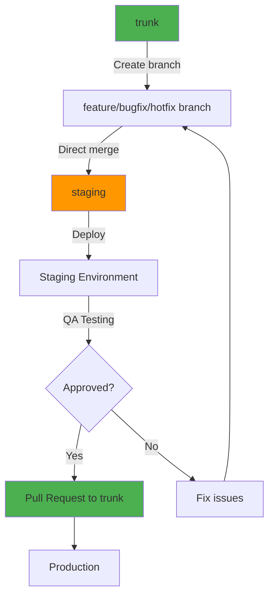

This project uses a **simplified Git Flow** approach that keeps production code clean while allowing thorough testing in a staging environment.

## Branch Overview

| Branch | Purpose | Deploys To |
|--------|---------|------------|
| `trunk` | Production-ready code (primary branch, source for all new branches) | **Production** |
| `staging` | Integration branch for testing | **Staging Environment** |

<Warning>
  **CRITICAL:** `staging` is NEVER merged into `trunk`.
  
  The `staging` branch is only used for testing purposes. When changes are approved, the **original working branch** is merged directly into `trunk`. This keeps our production branch clean and ensures full traceability of individual changes.
</Warning>

## Workflow Visualization



<Note>
  Notice that the arrow goes from your working branch **directly** to trunk, not from staging to trunk.
</Note>

## Branch Naming Conventions

Use descriptive branch names with the appropriate prefix:

| Type | Pattern | Example | Use Case |
|------|---------|---------|----------|
| Feature | `feature/short-description` | `feature/user-authentication` | New functionality |
| Bug Fix | `bugfix/short-description` | `bugfix/login-validation` | Non-urgent fixes |
| Hotfix | `hotfix/short-description` | `hotfix/critical-security-patch` | Urgent production fixes |

### Branch Naming Guidelines

- Use **lowercase letters**
- Use **hyphens** (`-`) to separate words
- Keep names **short but descriptive**
- Include ticket/issue number if applicable: `feature/123-user-auth`

<Accordion title="Examples of good branch names">
  - `feature/block-editor-integration`
  - `bugfix/42-theme-color-override`
  - `hotfix/critical-xss-vulnerability`
  - `feature/rest-api-endpoints`
  - `bugfix/navigation-menu-alignment`
</Accordion>

## Step-by-Step Workflow

The workflow is identical for all branch types. **The only difference is the branch name prefix** (`feature/`, `bugfix/`, or `hotfix/`).

<Steps>
  <Step title="Create your branch from trunk">
    Always create new branches from the latest `trunk`:

    ```bash
    git checkout trunk
    git pull origin trunk
    git checkout -b <type>/your-branch-name
    ```

    Replace `<type>` with `feature`, `bugfix`, or `hotfix` depending on your work.
  </Step>

  <Step title="Make your changes">
    Write your code and commit frequently:

    ```bash
    # Make changes to your code
    git add .
    git commit -m "feat: add user login functionality"
    ```

    See [commit message format](/contributing/standards#commit-messages) for guidelines.
  </Step>

  <Step title="Keep your branch updated">
    Regularly sync with the latest trunk changes:

    ```bash
    git fetch origin
    git rebase origin/trunk
    ```

    <Note>
      Using `rebase` instead of `merge` keeps your commit history clean and linear.
    </Note>
  </Step>

  <Step title="Merge directly into staging (No PR required)">
    Deploy to staging for testing:

    ```bash
    git checkout staging
    git pull origin staging
    git merge <type>/your-branch-name
    git push origin staging
    ```

    This deploys your changes to the **Staging Environment** for QA testing.

    <Warning>
      No Pull Request is required for merging to `staging`. This is a direct merge.
    </Warning>
  </Step>

  <Step title="Wait for QA approval">
    Your changes will be tested in the staging environment. The QA team will review:
    
    - Functionality works as expected
    - No regressions introduced
    - Meets acceptance criteria
    - Performance is acceptable
  </Step>

  <Step title="Open a Pull Request to trunk">
    After QA approval, create a Pull Request from **your working branch** directly to `trunk`:

    - **Source:** Your `feature/`, `bugfix/`, or `hotfix/` branch
    - **Target:** `trunk`
    - **NOT from staging**

    Once merged, your changes deploy to **Production**.
  </Step>
</Steps>

## Visual Flow Diagram

```
<type>/your-branch-name
         │
         ├────► staging (direct merge, no PR)
         │           │
         │           ▼
         │      Staging Environment
         │           │
         │       QA Approval
         │           │
         │           ▼
         └────► trunk (Pull Request required)
                     │
                     ▼
              Production Environment
```

## Pull Request Process

<Note>
  Pull Requests are **only required** when merging to `trunk`. You can merge directly to `staging` without a PR.
</Note>

### Before Submitting a PR to Trunk

Ensure your checklist is complete:

- [ ] Code has been tested in the staging environment
- [ ] QA has approved the changes
- [ ] Code follows project style guidelines
- [ ] All tests pass locally
- [ ] Branch is up to date with `trunk`
- [ ] Commit messages are clear and descriptive
- [ ] Documentation is updated (if applicable)

### PR Requirements

<Steps>
  <Step title="Write a clear title">
    Use a descriptive title that summarizes the change:
    
    - "Add REST API endpoints for custom post types"
    - "Fix navigation menu alignment on mobile devices"
    - "Update block editor integration for WordPress 6.9"
  </Step>

  <Step title="Provide detailed description">
    Explain:
    - What changes were made
    - Why they were necessary
    - How to test the changes
    - Any breaking changes or migration steps
  </Step>

  <Step title="Request reviewers">
    Request at least one reviewer who is familiar with the area of code you're changing.
  </Step>

  <Step title="Add appropriate labels">
    Use labels to categorize your PR:
    - `feature` for new functionality
    - `bugfix` for fixes
    - `documentation` for docs changes
  </Step>
</Steps>

### Merge Strategy

| Target Branch | Method | PR Required |
|---------------|--------|-------------|
| `staging` | Direct merge | ❌ No |
| `trunk` | Merge commit | ✅ Yes |

## What NOT To Do

<Warning>
  Avoid these common mistakes:
</Warning>

| Action | Why It's Wrong |
|--------|----------------|
| Merge `staging` into `trunk` | `staging` may contain untested or unapproved code |
| Create branches from `staging` | `staging` is not the source of truth |
| Skip testing in `staging` | Changes must be tested before production |
| Merge to `trunk` before QA approval | Untested code could reach production |
| Open a PR to `staging` | Direct merges are preferred for staging |

## Quick Reference

```bash
# Start any new work (always from trunk)
git checkout trunk && git pull
git checkout -b <type>/description   # feature/, bugfix/, or hotfix/

# Make your changes and commit
git add .
git commit -m "feat: description of change"

# Update your branch with latest trunk
git fetch origin
git rebase origin/trunk

# Merge to staging for testing (no PR needed)
git checkout staging
git pull origin staging
git merge <type>/description
git push origin staging

# After QA approval, create PR from your branch to trunk
# (Do this via GitHub/GitLab UI)
```

### Branch Rules Summary

| Rule | Description |
|------|-------------|
| **Create from** | Always create branches from `trunk` |
| **Staging merge** | Direct merge (no PR required) |
| **Trunk merge** | Pull Request required |
| **Never** | Never merge `staging` into `trunk` |
| **Never** | Never create branches from `staging` |

## Deployment

The project uses GitHub Actions to automatically deploy vendor folders:

- Workflow file: `.github/workflows/deploy-vendors.yml`
- Triggers on every push to `trunk` or `staging`
- Can be triggered manually via GitHub Actions UI

| Branch | Environment |
|--------|-------------|
| `trunk` | production |
| `staging` | staging |

<Accordion title="How deployment works">
  The workflow:
  1. Runs `composer install --no-dev` for each plugin/theme
  2. Uploads the `vendor/` folder to the appropriate environment
  3. Uses GitHub Environments to separate production and staging credentials
  4. Deploys via SFTP to WordPress.com hosting
</Accordion>

## Questions?

If you have questions about the workflow:

<CardGroup cols={2}>
  <Card title="Open an Issue" icon="github">
    Open an issue with the `question` label for workflow questions.
  </Card>
  
  <Card title="Contact Maintainers" icon="users">
    Reach out to the maintainers for clarification.
  </Card>
</CardGroup>